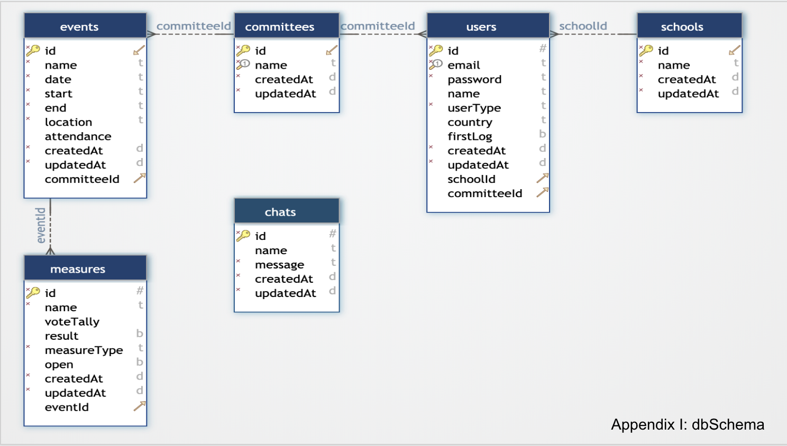
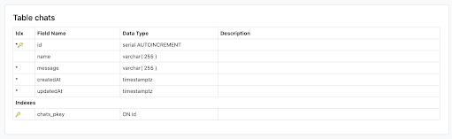
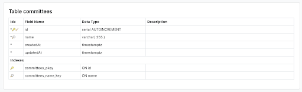
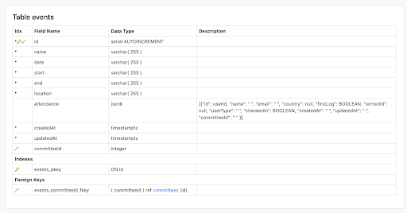
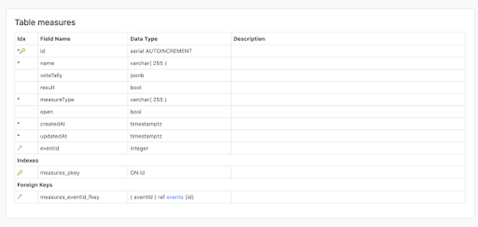
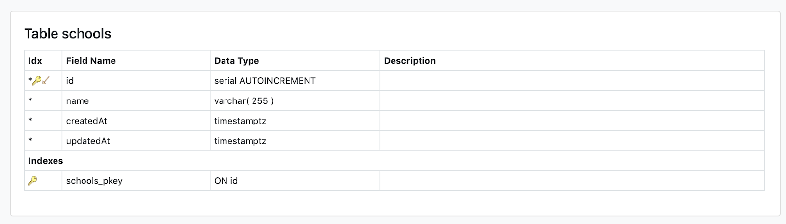
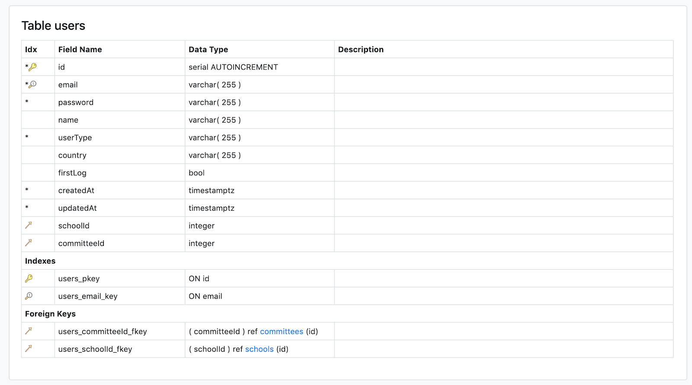

# <a href="https://con-do.herokuapp.com/">Con.DO</a>
<a href="https://con-do.herokuapp.com/">Con.DO</a> is a mobile-friendly white label web application designed to streamline conferences and/or other bigger events by allowing users to:
- See their schedule of events 
- Track user attendance through the use of uniquely generated QR codes
- Utilize an in-app chatting system 
- Vote on resolutions, or take polls
- Create other user accounts, which triggers an email containing a Magic Link that once clicked, logs the new user in and prompts the user to change their password

Currently, our app is built using Model United Nations (MUN) as a base conference example to show how our application also allows for different levels of authentication (i.e., administrators, organizers, teachers, and students).

## Deployment
This app is deployed using Heroku.  Click <a href="https://con-do.herokuapp.com/">here</a> to start interacting.

## Getting Started
These instructions will get you a copy of the project up and running on your local machine for development and testing purposes.

### Prerequisites
Before getting started, you will need to install:
* PostgreSQL - for instructions on how to download click <a href="https://www.postgresql.org/download/">here</a>.
* Node.js - for instructions on how to download click <a href="https://nodejs.org/en/">here</a>.

### Installing
1. Clone this GitHub Repo
2. From the root directory, run the command: 
```
yarn install
```
* <b><u>Note</u></b>: Our included scripts within  will cd into the client folder and do another ```yarn install``` for you!

3. Once the ```yarn install``` is complete, run this command to get the project up and running on your local machine: 
```
yarn start
```

## YouTube Demo
Click <a href="https://www.youtube.com/watch?v=VMj3Jn1hgCU">here</a> to view our walk-through demo of <a href="https://con-do.herokuapp.com/">Con.DO</a>.

## Database Schema Images
### Overall dbSchema:

### Chat Table:

### Committee Table:

### Event Table:

### Measures Table:

### School Table:

### User Table:



## Tools/Technologies Used
<a href="https://www.npmjs.com/package/axios">Axios</a><br>
<a href="https://getbootstrap.com/">Bootstrap</a><br>
<a href="https://www.npmjs.com/package/dotenv">DotEnv</a><br>
<a href="https://www.npmjs.com/package/express">Express.js</a><br>
<a href="https://fontawesome.com/">Font Awesome</a><br>
<a href="https://www.npmjs.com/package/generate-password">Generate Password</a><br>
<a href="https://fonts.google.com/">Google Fonts</a><br>
<a href="https://www.npmjs.com/package/json-web-token">JSON Web Token</a><br>
<a href="https://www.npmjs.com/package/match-sorter">Match Sorter</a><br>
<a href="https://nodejs.org/en/">Node.js</a><br>
<a href="http://www.passportjs.org/">Passport</a><br>
<a href="https://www.postgresql.org/">Postgres</a><br>
<a href="https://www.npmjs.com/package/qrcode">QRCode</a><br>
<a href="https://www.npmjs.com/package/react-router-dom">React Router Dom</a><br>
<a href="https://www.npmjs.com/package/react-qr-reader">React QR Reader</a><br>
<a href="https://www.npmjs.com/package/react-scroll">React Scroll</a><br>
<a href="https://www.npmjs.com/package/react-table">React Table</a><br>
<a href="https://www.npmjs.com/package/@sendgrid/mail">Sendgrid/mail</a><br>
<a href="http://docs.sequelizejs.com/">Sequelize</a><br>

## Authors
<a href="https://github.com/dagreatbrendino">Brendan Kelly</a><br>
<a href="https://github.com/ks563">Karen Shea</a><br>
<a href="https://github.com/morris-leaha">Leah Morris</a><br>
<a href="https://github.com/nwilseystarr">Nicole Wilsey-Starr</a><br>
